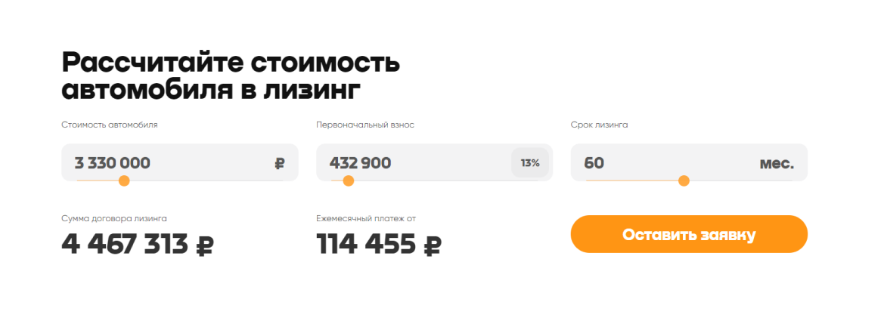

# <a id="top" />Тестовое задиние (Верстальщик)

## 

### Оглавление

- [Описание](#description)
- [Ссылки](#references)
- [Автор проекта](#author)

---

## <a id="description" />Описание

Тестовое задание

Необходимо сверстать макет из <strong>[фигмы](https://www.figma.com/file/tgAgxT0IrRQlauFCwK8i1R/%D0%A2%D0%B5%D1%81%D1%82%D0%BE%D0%B2%D0%B0%D1%8F-%D0%B2%D0%B5%D1%80%D1%81%D1%82%D0%BA%D0%B0-4?node-id=0%3A1&t=1P5aEdQI6f2CVyZA-1)</strong>. Результатом должен являться git репозиторий(Github, Gitlab, Bitbucket...) удовлетворяющий следующим требованиям:

Верстка должна удовлетворять PixelParallel.
Проект должен собираться с помощью одного из: gulp, webpack, vite.
Верстка по правилам БЭМ
Шрифты можно скачать по ссылкам Nekst, Gilroy.
Для CSS должно использоваться одно из: SASS, SCSS.
Должно быть больше одного комита в ваш репозиторй. Вы должны правильно разбить задачу на подзадачи и показать это в комитах.
В проекте должен присутствовать README.md с инструкциями о том, как запускать проект локально.
Верстка должна проходить проверку на https://validator.w3.org/.
Брейкпоинты:

- 320-767 (макет на 320px)
- 768-1119px (макет на 768px)
- 1120-1439px (макет на 1120px)
- 1440+ (макет на 1440px)
  Если у вас возникли какие-то вопросы, то делайте на свое усмотрение, просто отметьте потом эти особенности в README вашего проекта.

 

 
<strong>Дополнительно</strong>

Если верстка у вас не вызвала трудностей, то вы можете реализовать функционал калькулятора.

Калькулятор должен инициализироваться со значениями, указанными в Фигме.
В каждое поле можно ввести значение как с клавиатуры, так и с помощью ползунка.
При выборе значения с помощью ползунка, все числа должны пересчитываться динамически в процессе движения ползунка, а не только после его остановки.
У каждого поля есть максимальное и минимальное значение — ползунок должен ограничивать пользователя в выборе данных, а при вводе некорректного значения с клавиатуры, оно должно сбрасываться к ближайшему корректному числу (максимуму или минимуму).
Для поля “Стоимость автомобиля” границы: 1,5 млн.руб. — 10 млн.руб.
Для поля “Первоначальный взнос” границы: 10% - 60% от поля "Стоимость автомобиля". При вводе суммы в поле, должен показываться процент, который она составляет от стоимости автомобиля (округлять до целого значения).
Для поля “Срок лизинга” границы: 6 - 120 месяцев;
Формулы расчета для полей:
“Сумма договора лизинга” = Первоначальный взнос + Срок кредита в месяцах _ Ежемесячный платеж от
“Ежемесячный платеж от” = (Стоимость автомобиля - Первоначальный взнос) _ (0.05 \* Math.pow((1 + 0.05), Срок кредита в месяцах) / (Math.pow((1 + 0.05), Срок кредита в месяцах) - 1)
По кнопке “Оформить заявку” вы должны деактивировать ее, сформировать JSON со значениями всех полей и вывести его обычным alert.

 

### Функционал:

- Верстка интерфейса
- Реализация логики калькулятора

### Технологии

- HTML
- CSS
- JS
- Webpack

[Наверх](#top)

---

## <a id="references" />Ссылки

### Посмотреть проект можно [&rarr; ЗДЕСЬ &larr;](https://andreikolosov.github.io/friend_lee_test/)

[Наверх](#top)

---

## <a id="author" />Авторы

Андрей Колосов 2023г

- [Telegram ](https://t.me/RustyVoid)
- [Instagram](https://www.instagram.com/akolosof/)
- [Почта](mailto:oldliberty@yande.ru)

[Наверх](#top)
